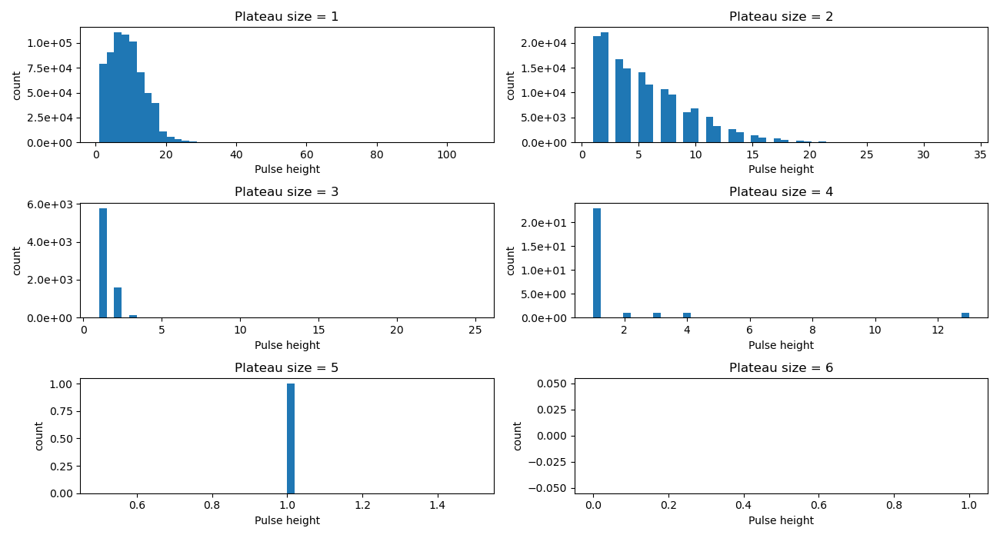

# Photon Position Reconstruction
## Introduction
This repository is created in order to predict the position of photons from given data.
Intensity Interferometry is the branch of Astronomy that aims to calculate the diameter of Stars.
Its experimental setup includes two Photo Multiplier Tubes (PMTs) which detect photons selected in the form of photocurrent ( depending on selected time binnings ). Thus, the generated data from two PMTs represent the photon emission pattern from the source with respect to time. Overall shapes in generated data, from both PMTs, can be different depending on the experimental setup and the used PMTs. However, in the case of the correlated photons, the location of the photon pulse is expected to be the same.

This project is part of research going on in the Erlangen Center of Astroparticle Physics (ECAP), and the data used in this project is from H.E.S.S. campaign-I. It is also an extension of my master's thesis, in which I attempted to 
<a href="https://dl.gi.de/handle/20.500.12116/39542" target="_blank">calculated the flux from PMTs using Deep Learning</a>.

## Dataset

There are two types of data generated from the experimental run.
1. Calibration data
2. Actual measurements

The calibration data is basically very low rate measurements. It is useful to extract the photon pulse shapes (complete). After extracting the pulse shapes, it is important to do EDA (exploratory data analysis), in order to figure out the unexpected photon pulse shapes, which can be discarded. Now, the set of shapes might have identical shapes. Depending on the selection one can remove or keep identical shapes (here identical shapes are removed). The resulting set of shapes can be used to create Monte Carlo datasets for Neural Networks(NNs).

### Monte Carlo (MC) simulations

The simulation focuses on the addition of a photon pulse (complete or partial), rather than first selecting the rate (in MHz) and then determining the number of pulses to be added. It also considers the scenario where pulses are partial ( at the edge of the sample). The following are the key points for using MC.

1. Single-channel MC simulation :

    - The first requirement is to select the desired sample size (here 256).
    - One needs to select a range of rates (number of pulses to be added) in samples. For example, if the selected range is from 0 to 100, then the simulation will generate a dataset, and in this dataset, one can find samples with pulses ranging from 0 to 100.
    - Then one needs to mention a number of example samples to be generated for each selected rate. This creates a balanced dataset and helps to avoid biased scenarios for training.
    - Finally, in the output, MC provides two types of data
        1. Input data: consists of added pulses
        2. Lable data: consists of a number of pulses added, for example fully added pulse/s are represented by integer values, while float value indicates sliced pulses, which are mainly cases closer to the edges of the sample.
    - A single run of simulation produces a single dataset. Therefore, one needs to use it three times for training data, testing data, and validation data.
2. Double channel MC simulation: This simulation is created in order to mimic the data generated from the two PMTs used in the experiment. It generates single-channel data first, and then in second-channel data generation, it randomly determines correlated pulse positions in both channels and adds the pulse into second-channel data, while the rest of the pulse positions could be uncorrelated. In this way, it applies the consideration of correlation from the entire range of selected rates.

## How to use
1. clone the repository
2. add calibration file to src/data/ 
3. go to the notebooks folder and use EDA_data_gen.ipynb for data analysis and desired data generation, which creates different datasets and saves them into DATASETS/sh06x2/
4. in the same folder run.ipynb can be used for data loading and model training. It saves model in models/sh06x2/, and training performance in model_performance/sh06x2/.

### OR
Install [the package](https://pypi.org/project/iimcsim/) using, 
```
pip install iimcsim
```
and follow the steps below.
#### sample generation
```ruby
import iimcsim.shape_ext as sh_ext
import iimcsim.tools as tools

shapes = sh_ext.shape_generator(
                        calib_file=r"C:\calib_ch0.npy",
                        high_rate_file = r"C:\Usersn\shaula_00000-003_ch0.npy",
                        path_to_save='C:\\Usestruction-main\\notebooks\\',
)
x1=shapes.generator(threshold=0, bin_num=2147483600)

df = tools.pulse_data(x1)
df.to_csv('data.csv')

uniq_shapes = tools.filter_shapes_based_on_plat_size(df, x1, lst=[2,3,4,5,6], 
                                                     save_path='/home/wcor/caao/110823/')
```
This will create a file named "plateauless_uniq_pulses_2345.npy" in the 
respected path.
#### Data analysis
```ruby
from iimcsim.tools import pulse_height, pulse_width, pulse_kurtosis, pulse_skewness
pulse_height(x1)
pulse_width(x1)
pulse_kurtosis(x1)
pulse_skewness(x1)
```



#### Generate dual-channel MC data
```ruby
import iimcsim.data_gen_run as dg
dg.data_gen_run().generate_data(train_exe = 50,
                    name = r"C:\photon_position_reconstruction-main\main\src\data\plateauless_uniq_pulses_2345.npy",
                    samp_size = 256,
                    max_num_photon = 90,
                    folder_name = 'sh06x2')
```
#### Models
```ruby	
# MODELS
from iimcsim.MODELS import MODELS as models

model = models().UNET(bins=256, channel=1, loss_func='mse', opt='adam', metric='mae', reg=0.1, filt_num=2)
```
## Results
After pulse analysis, we perform model(U-Net) training and then it is important to figure out in which region predictions are more accurate. Because significant number of pulses are highly right-skewed, it affects each MC data.
In our problem, what we seek to predict is, do we have peak(full pulse) available at specific bin or not. And if there is peak, then how many peaks are there at specific bin. Let’s call it peak-no-peak scenario.
Number of peaks at specific bin depends on following cases,
Actual rate of sample: High enough rate increases probability of having multiple overlapped peaks
Edges of the sample:
Left edge: first bin of the samples can have more variety of sliced samples, resulting in fractional peak in ground truth (because of the right skewness)
Right edge: last few bins of the sample have sliced pulses, therefore in ground truth of such samples have fraction of pulse distributed in last few bins, depending on added pulse width of specific pulse
Consideration of both cases allows MC to add more complexity. Especially at higher rate it is more difficult scenario than identifying overlapped full pulses.
In this way, we expect that the trained neural network, predicting more accurately on region far from left and right edges of the sample, due to chances of less complexity.

Consideration of sliced pulses:
It covers entire range of rate, instead of covering specific rate examples (based on only number of pulses added in a sample; unlike previous attempts where the aim was to train model for flux calculation).
This comes with requirement of extremely huge data requirement to train and get efficiently predicting model. And if not satisfied, then imbalance data can degrade the training of NN.
In present MC, I tried to minimize drawback of point 2, by increasing number of examples.


Using a large dataset from the above-mentioned method, we trained our model and,
first tried to compare the flux prediction of the model over a test dataset.
The below figure depicts a comparison of model prediction over the sample and over population.
Since the set of samples(with a certain average rate), has partial random pulse shapes, their truth has a certain average and uncertainty. For lower to moderate rates (0-900 MHz), Unet's average predictions are quite accurate, while at extremely higher rates it starts deviating.
Here, our single set of examples is of 1920 samples, which results in very small uncertainties in population predictions.

The plot below depicts the average prediction error as a function of rate.

Since in the label, there are several floats (sliced samples as the edge), we applied the veto over at the edges (LHS:6bins; RHS:10 bins). Then we rounded the predictions.
- 80% of the time model can successfully identify the background.
- 70% of the un-overlapped peaks of pulses were identified by the model correctly.

